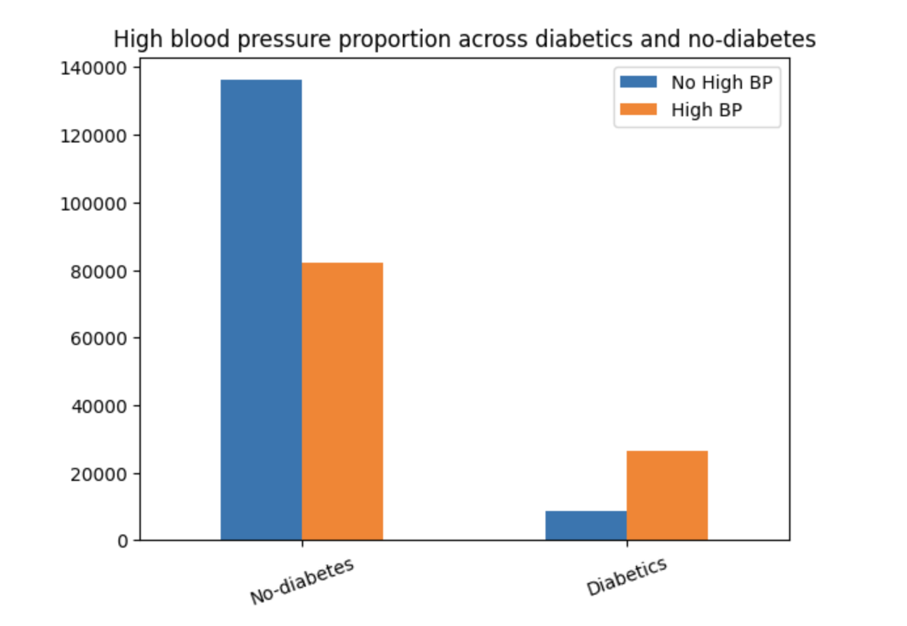
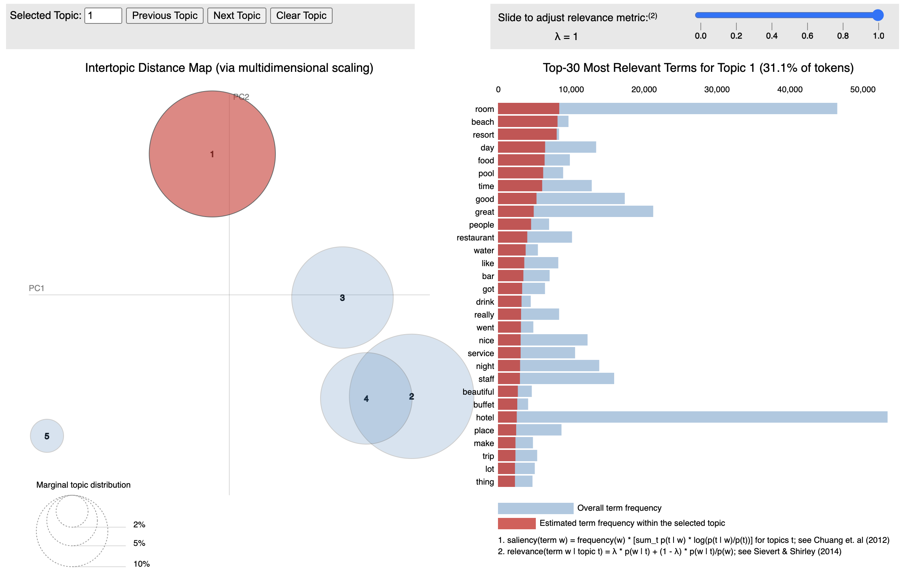
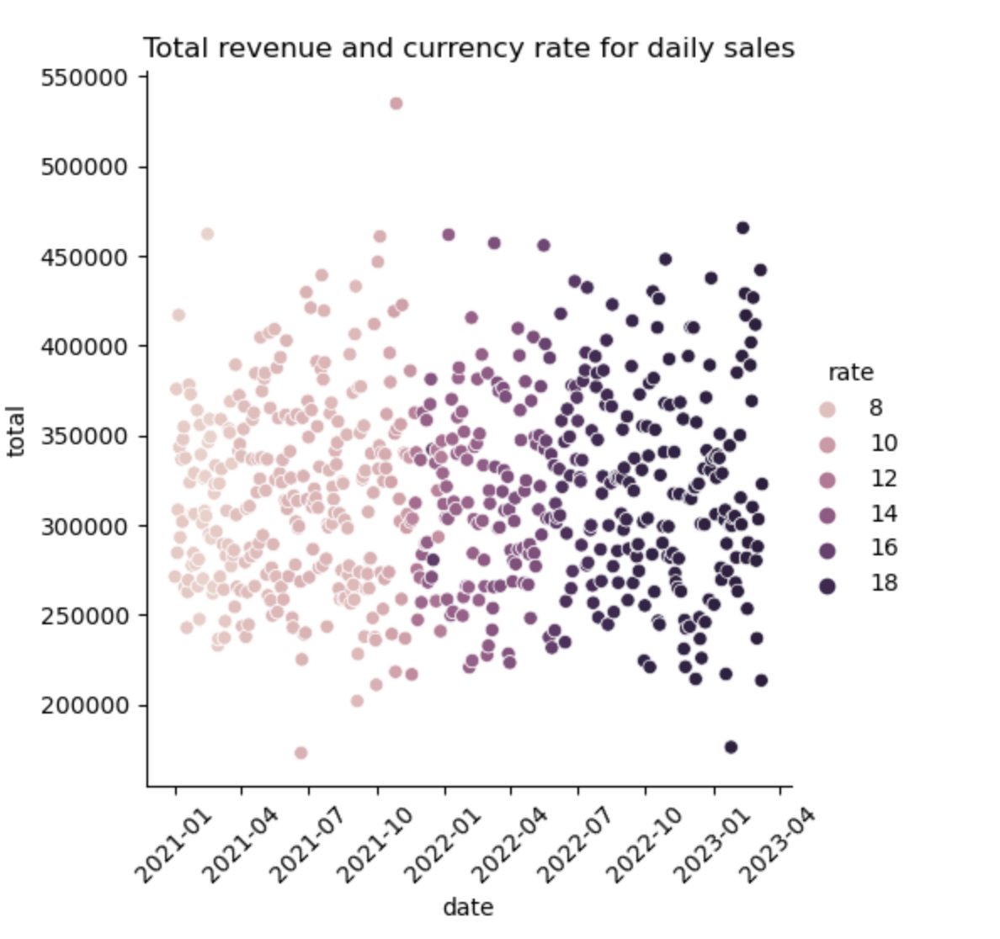
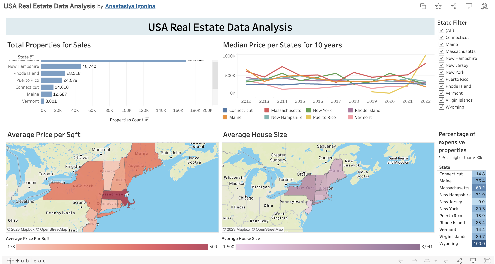
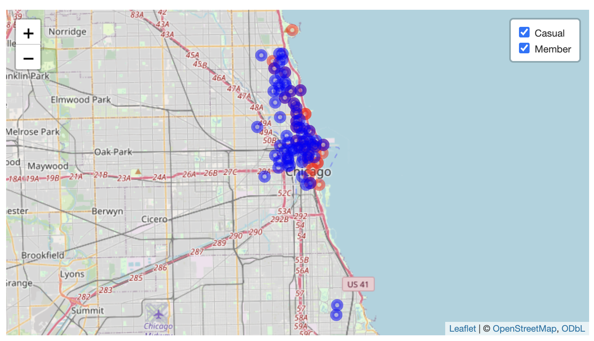
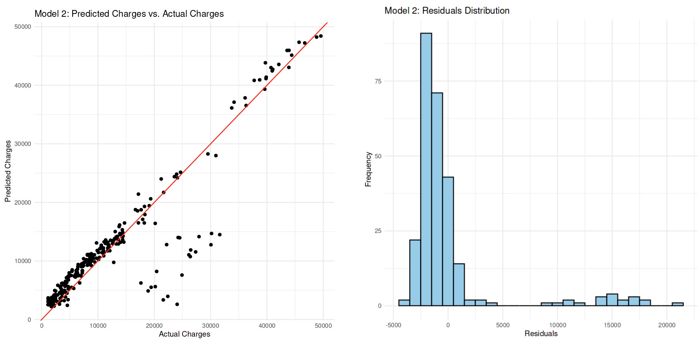

# Portfolio_Projects

This repository contains a collection of my projects, each showcasing my passion for data analysis. These projects, recognized on Kaggle (silver medals, over 10,000 views, 200+ forks), demonstrate my skills across various data analysis tools, programming languages, and problem-solving abilities. Each project is a unique journey, providing insightful solutions to real-world challenges.

## [Diabetes: EDA, hypothesis testing, predictions with Python](https://github.com/anastasiyaigonina/Portfolio_Projects/tree/main/diabetes_hypothesis_predictions)

* Conducted comprehensive analysis of more than 250k diabetes medical data, utilizing exploratory data analysis (EDA) and hypothesis testing to identify key factors impacting diabetes.
* Developed and evaluated multiple predictive models to accurately determine diabetes status, with the best-performing model achieving an accuracy of 90%, enhancing early detection, treatment, and management of diabetes.

Kaggle notebook: https://www.kaggle.com/code/anastasiyaigonina/diabetes-eda-hypothesis-testing-predictions

## [Reviews: Sentiment, Topic Modeling, Clustering with Python](https://github.com/anastasiyaigonina/Portfolio_Projects/tree/main/reviews_sentiment_topic_modeling)

* Analyzed 20k hotel reviews with advanced data analysis techniques, including sentiment analysis, prediction modeling, topic modeling, and negative reviews clustering. 
* Achieved a high accuracy of 85% in sentiment prediction, providing deep insights into customer feedback to boost satisfaction. Identified key topics in reviews, allowing targeted improvements in services and facilities to meet customer expectations.

Kaggle notebook: https://www.kaggle.com/code/anastasiyaigonina/reviews-sentiment-topic-modeling-clustering 

## [Retail Sales: EDA and Spending Predictions with Python](https://github.com/anastasiyaigonina/Portfolio_Projects/tree/main/retails_sales_eda_predictions)

* Conducted comprehensive analysis of retail sales data in Istanbul (100k+ records), involving data cleaning, preparation, exploratory data analysis (EDA) to uncover meaningful patterns and insights, including the correlation between total revenue and currency rates.
* Developed highly accurate predictive models with an accuracy rate of 98%, resulting in enhanced sales predictions, optimized marketing strategies, and improved financial performance.

Kaggle notebook: https://www.kaggle.com/code/anastasiyaigonina/retail-sales-eda-and-spending-predictions

## [Real Estate Data Analysis using SQL](https://github.com/anastasiyaigonina/Portfolio_Projects/tree/main/real_estate_data_analysis_sql)

* Conducted in-depth analysis of US real estate data (200k+ entries) using SQL, applying various techniques such as group by, joins, subqueries, and window functions to uncover insights on property prices, trends, and geographical distribution.
* Created an interactive Tableau dashboard to visualize findings, providing a clear understanding of market dynamics and supporting data-driven decision-making.

Kaggle notebook: https://www.kaggle.com/code/anastasiyaigonina/real-estate-data-analysis-using-sql

## [Cyclistic Case Study: Data Analysis with R](https://github.com/anastasiyaigonina/Portfolio_Projects/tree/main/cyclistic_case_study_r)

* Analyzed a massive dataset of 5 million records for a bike-sharing company, utilizing a structured analytical approach. That included formulating questions, preparing and processing the data, performing extensive analysis, and effectively communicating findings to support informed business decision-making.
* The project uncovered valuable insights and actionable recommendations to improve customer experience, boost profitability, and drive business growth.

Kaggle notebook: https://www.kaggle.com/code/anastasiyaigonina/cyclistic-case-study-data-analysis-with-r

## [Insurance Charges: Exploratory Data Analysis and Predictions with R](https://github.com/anastasiyaigonina/Portfolio_Projects/tree/main/insurance_charges_prediction)

* Performed comprehensive exploratory data analysis on insurance charges, examining variable distributions and correlations to identify key cost drivers and their impacts.
* Developed a robust linear regression model with an accuracy of 86% in predicting insurance charges, supporting data-driven decision-making and cost optimization strategies for insurance providers.

Kaggle notebook: https://www.kaggle.com/code/anastasiyaigonina/insurance-charges-eda-and-predictions-with-r/

