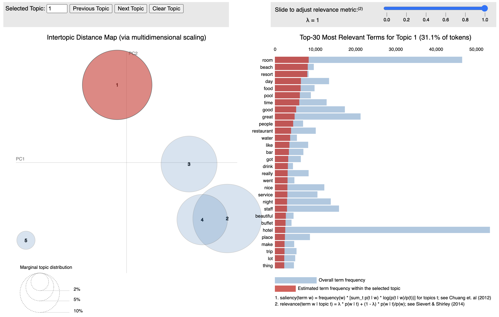

# Reviews: Sentiment, Topic Modeling, Clustering with Python

This project focuses on analyzing hotel reviews using data analysis techniques, sentiment analysis, prediction modeling, topic modeling, and negative reviews clustering. The goal is to gain insights from the reviews, predict sentiment, identify key topics, and group similar negative reviews. The findings contribute to improving customer satisfaction and decision-making processes in the hotel industry.

This repository contains data csv file, Jupyter Notebook as well as Python script.

Additionally, you can check the comprehensive notebook and explore an interactive topic modeling visualization here https://www.kaggle.com/code/anastasiyaigonina/reviews-sentiment-topic-modeling-clustering?scriptVersionId=132366499 

## About Dataset

20k hotel reviews extracted from Tripadvisor.
Hotels play a crucial role in traveling and with the increased access to information new pathways of selecting the best ones emerged. With this dataset, consisting of 20k reviews crawled from Tripadvisor, you can explore what makes a great hotel and maybe even use this model in your travels!
Predict Review Rating
Topic Modeling on Reviews
Explore key aspects that make hotels good or bad

Data source: https://www.kaggle.com/datasets/andrewmvd/trip-advisor-hotel-reviews 
